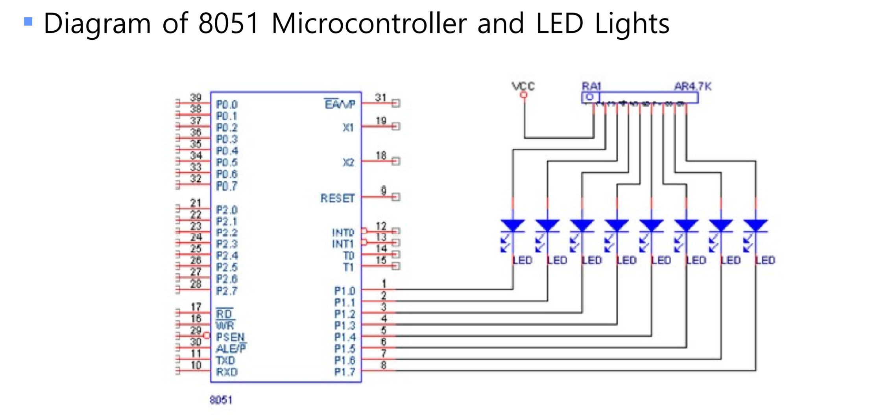
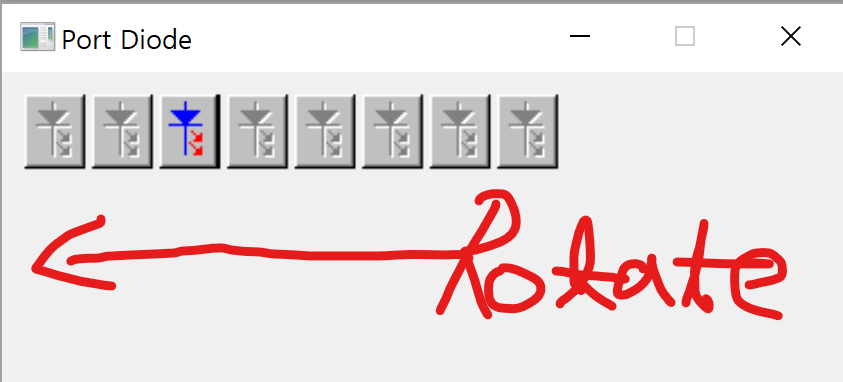

## Port Diode Blinking



---

In this program, diodes rotate in left order, cause RL instruction shifts Accumulator A, Change it to `RR` if you wanna Left Shift

```
; MAIN LOOP
LOOP:
	MOV P1, A
	RR A
	; ROTATE LIGHT, ALSO CAN ROTATE RIGHT 
	; BY USING "RR" CMD
	CALL DELAY
	JMP LOOP
```


