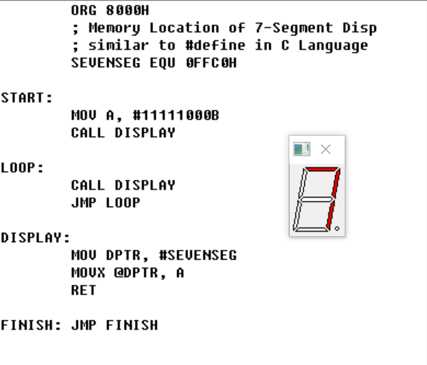
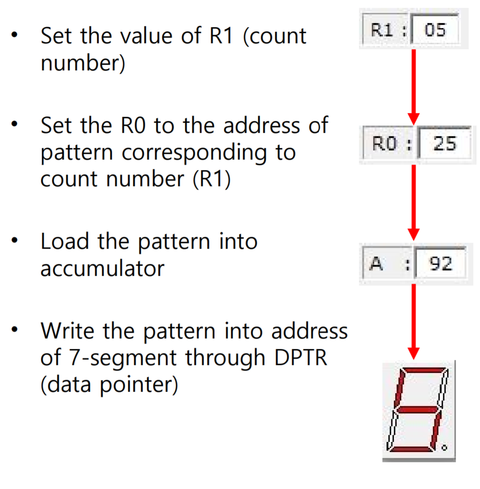

## Seven Segments

---

Basic Insturction for controlling each segments

Each Segments matched with register bit.

Save Each Segment values to external Memory, select prefer number value from stored memory.

Basic Logic for setting segment number.

## Reference

Difference between `MOV` and `MOVX` instuction.

