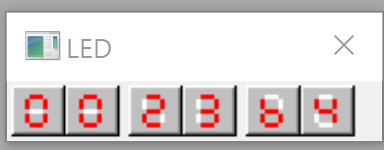
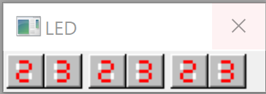
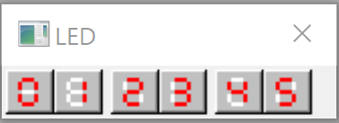
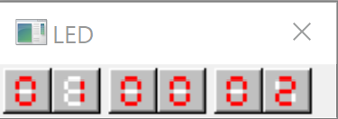

# SEVEN SEGMENT ARRAY

8051 Emulator has 6 digit Seven Segment Array, In order to use them, define their memory locations into variable.

```asm
; MEMORY LOCATIONS OF 7-SEG ARRAY
SEG1 EQU 0FFC3H
SEG2 EQU 0FFC2H
SEG3 EQU 0FFC1H
```

1. Make middle display showing `23`s



2. Make All display area showing `23`

To show `23`, you can use three types of number expression.

```
	MOV A, #00100011B
	MOV A, #23H
	MOV A, #35
```


3. Display `012345`



4. Learn about `DA` Instruction. Which can handle BCD carrys. 

Display `009999`, then increment displays at least once. 



