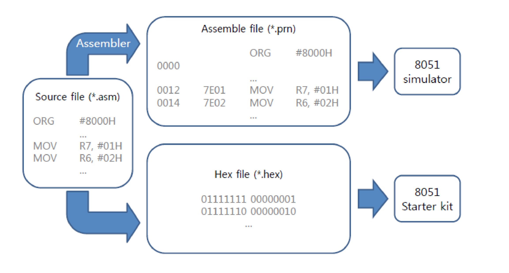

# Intel_8051_Assembly

Assembly Codes for MicroProcessor Class
(@Hanyang Univ. Prof David Wagner)

This programs only runs on `intel 8051 MicroProcessor`
`ARM`, `Motorola` MicroProcessors have differenct Assembly Grammer

---

## File Structure

Each Folder contains
- Assembly language
- *.prn files for Simulator
- *.hex files for 8051 Development Board

### 1. Port Diodes Blinking and Shifting

- Control equipped Port Diodes
- Shifting Diode positions using Accumulator
- Basic Assembly Language Instructions (JMP, MOV, ORG, LOOP etc...) 

### 2. Delay Function

- Learn about 8051 registers
- Make 1 second delay using assembly language
- Debugging through register status

### 3. Handling Seven Segments

1. Rotate Segments

- Handle External Memory (using `DPTR`)
- Learn about Status Register `PSW`

> - Assignment
> 
> Write a program to display each number in order
> 

## Reference

- [MicroProcessor Class Hanyang Univ.]()